# Alternate Realities

##### There are currently broken images because I deleted the repo and apparently I didn't save the images...
____

## QuickNav

[a world on fire.](#a-world-on-fire)

[but deliver us from evil.](#but-deliver-us-from-evil)

[our demons.](#our-demons)

____

## a world on fire.

### Intro: The Kickoff.

So, the first project of the semester. How did it turn out? Well, here it is.

### The Concept: A World On Fire.

The concept of the scene and the world is something I explained in my project proposal. I'll just copy pasta it here.

The fantasy world is simply called “Earth” by its inhabitants. The continent of where the story takes place is the Eternian Commonwealth, a land ruled by seven kings. This was the result of a short and brutal war spearheaded by a prince of the Eternian Kingdom, who ‘conquered’ all the kingdoms in less than five years when they all said they were willing to sign a treaty. There were originally eight kingdoms.
In any case, the setting is medieval, a fantasy world where magic exists but is rather rare. As a result, almost all magicians are in the royal cities of their respective kingdoms. Even though there are monsters that roam about, the absence of magicians isn’t too much of a problem for villages out in the countrysides because of the existence of the Phalanx Guild, which trains ‘Adventurers’ who go out and perform tasks for compensation. The Phalanx Guild is supported by the kingdoms, meaning that they add to the rewards given out (as to lighten the load of commoners).
Anyway, there are also people called Hunters who are elite Adventurers who can handle pretty much every task. There are two entities above Hunters, but they aren’t relative to the story at hand, at least not in the moment of the scene.
And finally, among the monsters there are those that are feared by all–– one of these monsters is the creature known as the dragon. Rarely seen but known by all, these creatures are known to be able to wipe out entire villages and even cities. Hunters are a must, but sometimes even they aren’t a match for the legendary beasts. There is one group of people who take them on, though–– if they can actually be called people… But that’s a different story for a different time.

The village Drywell is in the southeastern part of the Eternian Commonwealth, located in the Eternian Kingdom. It’s a community of merchants, and the particular scene is a dragon attack, one of those uber-rare events that don’t happen very often. Fun, right?

Here's a shot of the scene I was picturing:

As for the reason why the dragon attacked in the first place–– a traveller found an interesting rock that glittered when exposed to fire. They brought it to the village without knowing it was the egg of a dragon.
Anyway, as a small community, there are some buildings, but not a lot. Most of them are made of wood, which is readily available in the area. There are a few buildings made of stone, but not a lot. Stone is heavy and requires a lot of effort to carry from the nearest quarry, which is some five kilometers away.
There’s a main road that runs through the town. There’s a forest around the village and mountains some distance away, too. These mountains are where the dragon came from.

And here's the idea of the storyboarding I had:

And then I thought it'd be easier for me to draw out the main scene from the top:

The idea was to have an additional character, the "main" character, appear a few moments before the end when the dragon breathes fire on you, but I didn't have time to create a model with a cloth setup so that fell through. But that's enough of the concept, let's get to the process.

### The Process: Lots of Waiting. Last Minute Energy.

So, first things first, a lot of assets means that there's going to be a *lot* of waiting, both for GitHub and within Unity itself. Idiot me thought that it would be an amazing idea to try and download as many assets as possible so that I'd be covered on all fronts. Little did I know that doing so would result in a project folder of over 10GB. *Yep*. Bad idea. Just uploading to GitHub took at *least* 20-30 minutes, and that was *if* the LFS bit worked right (spoiler: it didn't). And then I had the amazing idea of trying to convert the build to Android and get Oculus support before I had finished creating the scene. I hit 3 hours of waiting for the conversion to finish, with my project incomplete. Absolutely *fantastic*. This was before the notice that we didn't need to actually run the thing on the Quest 2, which definitely made me feel like I didn't utilize my time very well.

But the bulk of the project happened pretty last-minute. This was because I hit the point where I actually started understanding what I was doing and how things worked (except sound, still dunno what's up with that) pretty late. It's not that I *wasn't* trying to understand, of course; it was just really confusing and most of the time was spent trying to understand all the tools available. So let's go. Here's the project deets.

#### The Terrain

Anyway, I guess I can talk about how the scene is built. It's bascially a combination of four terrain 3d objects. I used the built-in terrain brush features to add textures (materials from various asset packs and the materials lab) as well as to create the landscape. I was a bit confused on how to use the textures, but I think I figured it out (very tentative *think*). I also used the brush to create trees and grass. I know we learned to use Polybrush, but I thought that I'd try using the built-in one this time. Here's a terrain solo shot:

#### The Buildings

There are some buildings in the scene, and I tried to keep a similar color palette of dark and dreary colors, as well as materials by focusing on wooden buildings and the occasional stone building. These were from a range of diferent asset packs (which caused some issues, as mentioned earlier with the size but also because of different and/or redundant dependencies). Some of the buildings (if you look closely) aren't really furnished at all and (if you look even more closely) aren't actually full buildings. I took some pieces of buildings that matched the overall vibe and placed them in the view of the main camera but didn't furnish their interiors or complete the buildings. This was because the user wouldn't be able to move around; they wouldn't be able to see that the buildings weren't complete ones. It's a bit lazy on my side but I also think that it's completely rational considering that you don't want to create more objects within the scene than necessary. In other words, the philosophy I went by with this scene was to show only what I needed to. Less is more... right? Well I guess that kind of contradicts what I did with the people assets later... In any case, here's the scene with the buildings added to it.

#### The Dragon and FIREEEE

And here's the spice, the sprinkle of razzle-dazzle, to the scene: the dragon(!!!) and the fire(!!!) effects. The dragon is from an asset pack (obviously; I was still struggling to use terrain brushes until a week ago–– there's no way I'd be able to model a 3D dragon complete with animations), as are the fire effects (thank you Unity Asset Store). But the position and animation-change bits for the dragon are from a manual script. *Why*, you might ask, *would one ever think about manually animating the positions and the different actions of an object?* Well, the answer lies in a single term: *legacy animations*. This, I believe, is a problem that arises when you download assets from the Internet. Some of them are old, meaning that they don't fit in with the latest version of Unity. This means that you need to update the materials or create new materials with the given textures in the case that the automatic update doesn't work. In addition, you can't use the built-in Unity animation scripter because it doesn't support legacy aniations. *Oh joy*.

*Anyway*, the script for the dragon is rather simple, using the SmoothStep function to create a more natural animation. I needed a script because I wanted to play two animations at once (position and action) but because the legacy animations were a) read only and b) unsupported by the build-in animator. I ultimately chose to make everything time-based (I'm sorry, dynamic programming based on other objects will come later; I just don't know Unity well enough). Here's the code for the Update() function for the dragon:

    // Decrementing time
    totalTime -= Time.deltaTime;
    //Debug.Log(totalTime);

    // Bring dragon down to ground first 15 seconds
    if (100 > totalTime && totalTime > 90)
    {
        float t = (Time.time - startTime) / duration;
        //Debug.Log(t);
        transform.position = new Vector3(Mathf.SmoothStep(startLoc.position.x, endLoc.position
        .x, t), Mathf.SmoothStep(startLoc.position.y, endLoc.position
        .y, t), Mathf.SmoothStep(startLoc.position.z, endLoc.position
        .z, t));
    }
    else if (91 > totalTime && totalTime >= 86)
    {
        if (!isStationary)
        {
            // land after reaching end spot
            ani.Play("FlyStationaryToLanding");
            isStationary = true;
        }
        if (!ani.isPlaying)
        {
            ani.Play("idleBreathe");
        }
    }
    else if (totalTime < 87)
    {
        ani.Play("spreadFire");
    }

It's very basic code, and there initially was a lot more (stationary mid-air, breathing fire, then flying again, then landing) but I deleted it in the process of not being able to figure out how to make the animation transitions a bit more smooth. I only found out recently, that it was because the animations were all set as looping animations. I fixed up the new and simplified actions of the dragon.

The fire, on the other hand, was a bit more manual. Thankfully all of the particle effects were already there and I could use the built-in animator (Timeline) to spawn the fire on command. Here's how ~~manual~~ the process looked:

#### Humans: Fighters and Runners

And now we move on to the puny humans who run in fear of the mighty dragon. They're split mainly into two groups, the fighters and the runners. It's rather straightforward. 

Fighters fight for like 3 seconds and die (split into two groups with different timings), runners just keep running. Their actions are also time-based. Here's the code for their Update() functions.

        // Fighters

        // only alive for the first 15 seconds (wait 12 seconds fight 3 seconds)
        if (85 < totalTime && totalTime < 88)
        {
            // if fighting, switches between attacks
            if (isFighting && !ani.isPlaying)
            {
                isFighting = !isFighting;
                ani.Play("prepare spear");
            }
            else if (!isFighting && !ani.isPlaying)
            {
                isFighting = !isFighting;
                ani.Play("attack spear");
            }
            
        }
        // dies after 20 seconds
        else if (totalTime < 85 && !isDead)
        {
            ani.Play("die");
            isDead = true;
        }
        
        
        // Runners
        
        // All runners do is.. run.
        float t = (Time.time - startTime) / duration;
        //Debug.Log(t);
        this.transform.position += this.transform.forward * 0.02f;

About their skins, they might look a bit awkward but that's because I needed to recreate their materials because they were outdated (ah, legacy assets strike again) and didn't go as in-depth as I should have. But they all disappear/die anyway so I thought it was okay.

#### Sound

So this is a bit iffy. I added sound, but I have no idea how it will play because my editor doesn't seem to have an output for audio. I can see that something is happening, seen by how the mixer bar is constantly hitting the red, but I myself cannot hear it. I might as well explain what sounds I added. I added one for the dragon (Godzilla noises lol), the people who pass by you (a lot of heavy breathing, scared whimpers), the fire (crackle crackle), and the night ambience (nice crickets and the beautiful sound of everyone panicking and screaming).

### Issues

This section will be short because I don't want to relive everything again.

#### GitHub

So. I reached my LFS limit and GitHub has officially deactivated my LFS tracking. *Fun*. This was also the reason why I was unable to save my progress for a 6+ hour session in the library and *ended up having to delete everything*. Not sure how everything will work from now on, but I may just use the repos as a place to keep packages of the scenes, rather than the entire projects.

#### Animations

Legacy. Legacy. Legacy. Please end this nightmare.

#### Compilation Errors

Have you ever accidentally touched something and watched as thousands of compilation errors came raining down on you? *Yep*. That happened. A lot.

### Afterword: Ain't Doin' This Again. (Part 1 of 3)

And how do I feel about this project? Well, I'm not really satisfied with it. I could have done a *lot* more if I had another weekend. I started understanding how to use Unity and utilize scripts just *moments* before the project was due, which really sucks (but is also nice because now I understand). But I got (some) of it to work, so there's that.

But this was still kind of a nightmare to do (many all-nighters, even more issues, compilation errors) and I'm guessing that there are more nightmares to come. But I will (hopefully) be better equipped to face them in the future.

____

## but deliver us from evil.

##### Collab with Dhabia

### Intro: Here We Go Again...
Welcome to another episode of nightmares in coding and all-nighters! Not as many all-nighters this time round, but just as many (if not more) problems!

### The Conception: Hear me out. What if we…
make a fun little cooking simulator that turns out to be you making a bomb? This was the ‘grand’ idea that I tossed out during our brainstorming session. It seemed like it would be fun and there was a guarantee that it would be interactive. Like Cooking Mama, just a lot darker. It was just a silly idea that my child-like, short-attention-spanned mind produced, at least until it actually became the theme of our project.

### The Story
So here’s the story. When you open your eyes, you’re in a room. There’s not much, just a few shelves here and there, a radio, and in front of you are tables and a stove. One of the tables has ingredients, a cutting board, and a pot. Another has some cookie-cutters, a few strange black boxes and colorful strings.
And so, after a moment of pondering, you decide to step forward and do what comes naturally to you–– work with what you have. When life gives you lemons, you make lemonade. So when life gives you ingredients, you… cook them?
In any case, as you start cooking and molding the mixture, you hear some news about bombings from nearby–– or at least you have reason to think it’s nearby; why else would it be on the radio ––but don’t think much of it. After all, it’s a one-in-a-million chance something will happen to you, right? And so you continue your work, decorating your mixture with the little black boxes and the colorful wires–– not strings, you can tell because they’re so stiff ––until you finally make a few completed products.
Something feels off, but you smile nonetheless, feeling accomplished. You put them down in front of you and admire your handiwork. A bomb. Hmm. Something feels off, but you don’t know what it is. Shrugging, you place your finished product in the delivery zone and listen as more reports of explosions sound in the background…

### Interactions: The Name of the Game
The plan was to have at least 4 interactions. The first was the cutting of ingredients, followed by the scraping of ingredients from the cutting board into the pot. Then would come a few sprinkles of shakers and a quick mix with a spoon. After that would be the stove, where you cook all the ingredients together by turning up the heat with a dial. Once the mixture finished cooking, the pot would go to the second table and there you would mold the mixture into a block and then wire the explosive (oops, spoiler alert) and finally place it into the delivery zone. Wait a sec that’s a lot more than 4 interactions…

*Anyway,* the point was to make a fun little interactive scene for users to mess around with ingredients and have fun.

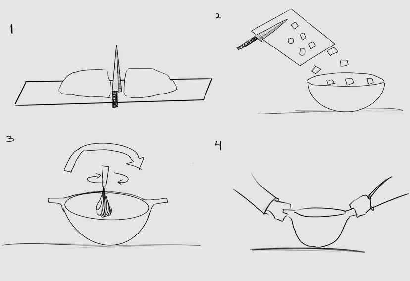

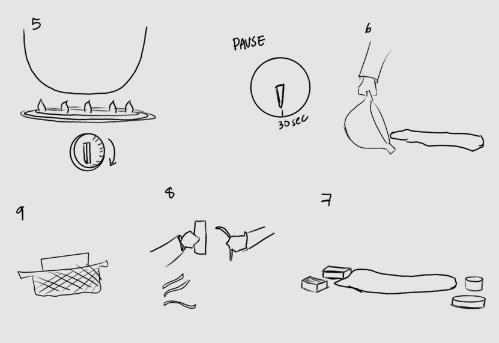

But we also needed to make sure they’d go in order. The original idea was that we would make all items of a station non-interactive unless the user finished a step previous to it, but as we progressed I realized that scripting all of that would be a really, really big pain. I could have technically hardcoded it all, but I chose to take the easy way out and used walls (explained later).

### The Result
Might as well start with the results of the project. These are some screenshots of the scene, and [here](https://www.youtube.com/watch?v=EAwe0Z3G0WY&ab_channel=DhabiaKM) is the link to the playthrough.

An overview of the scene (left)

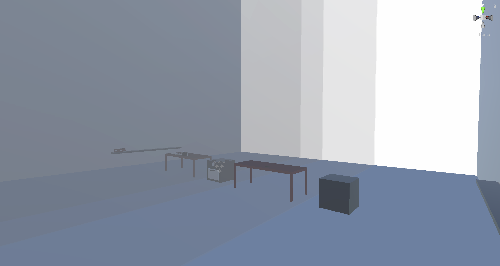

An overview of the scene (right)

It took a while trying to get the assets in the right places to give a sense of aesthetic, but I think the placements worked out okay. So, now that all of that’s out of the way, let’s get to the main stuff: our ~~suffering~~ process.

### The Process

There were more things to consider in this project, now that interactions were on the table. No external 3D assets, meaning that we needed to make anything that we were planning on using. And now we were moving around, too, so we needed to consider that as well.

#### Locomotion

One thing that I decided the first moment we learned about locomotion and teleportation was that I was going to make smooth locomotion and turning, no matter what it took. I just didn’t like the concept of having to teleport everywhere and how snap turning didn’t give you enough freedom to look around. And so that’s what I did, surfing around the Internet in order to find how to make that a possibility. Turns out I didn’t have to look far, because the XR Interaction Toolkit that we had already had these features and I just needed to initialize them with some help from the Unity Manual and the authors’ GitHub repo.

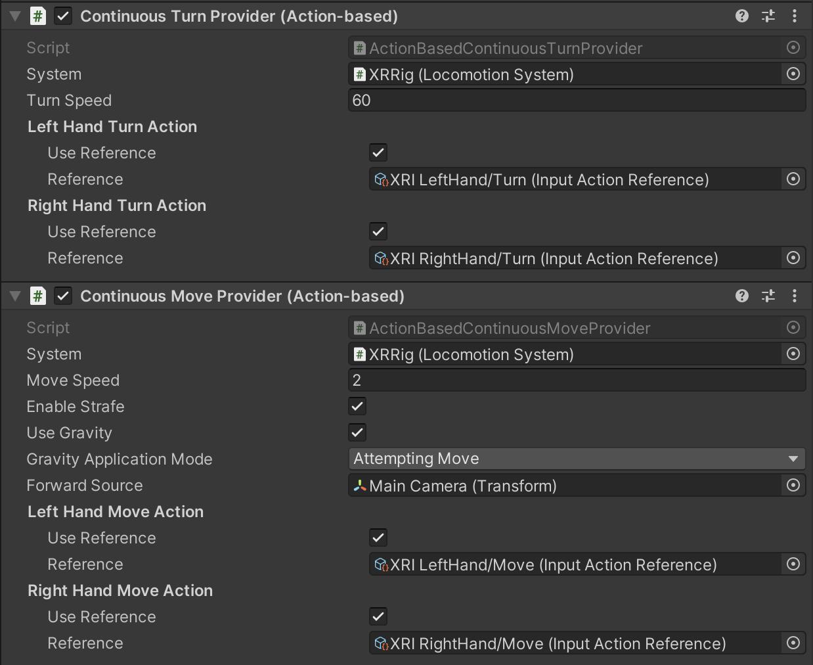

Technically, I think that locomotion is a form of interaction. It’s the most basic kind of interaction that a player can make, though, so I wouldn’t consider it an interaction that would drive the plot forward (though you *could* argue that it *literally* drives the plot forward). Anyway, that’s not the point. The point is that I added smooth locomotion and turning and I am very happy with it.

#### Singletons

I was wondering how to make global variables in Unity and came across singletons. It was very intuitive, and the fact that the variables could be called across different scripts by calling for the Global.Instance was really cool. I ended up using it in order to track the progress of the user, as well as to decide the order in which the user can progress throughout the game. The Global object has three walls that are semi-transparent in order to “lock” the user into a specific station within the scene. These are “unlocked” when the user performs all of the tasks that are required in order to progress. Here's the code for the singleton and the global variables:

    public static Global Instance { get; private set; }
    // check if cut ingredients have been added
    public bool ingredientsAdded;
    // check if both shakers have been used
    public bool razzleDazzled;
    // check if pot has been stirred
    public bool isStirred;
    // check if pot is cooking/has been cooked (turning dial activates trigger)
    public bool isCooking;
    public bool isCooked;
    // check if pot has been placed on molding table
    public bool isPlaced;
    // check if bomb has been assembled
    public bool isAssembled;
    // check to ensure singleton instance
    void Awake()
    {
        if (Instance != null)
        {
            Debug.LogError("There is more than one instance!");
            return;
        }

        Instance = this;
    }

#### Guiding Interactions

This bit with the walls was the alternative to scripting for turning off interactions for all objects that weren’t being used, and I think it’s a pretty good way to guide the user through the interactions.

Some other considerations was the use of shaders, outer-diffuse shaders in particular, to highlight the objects that should be used. But the logistics of that seemed to be a bit too complicated to do in this project.

Another idea was possibly changing the material of all non-interactable objects gray. This one seemed too complicated because the idea came up halfway through, meaning that we would have to go back and change everything we had already created.

In the end, we decided on the walls but also played around with the interactivity of the pot. You can only interact with it and place it on the stove once you put in the ingredients and mix them; after that you can only interact with it when turning the stove dial once the mixture has finished cooking.

#### Assets

So as you can see we have custom assets, but their original shapes and sizes are actually a lot different from those in the game. I had to manually edit the sizes to make them look clean, which actually took a lot longer than expected because I needed to make mesh colliders so they wouldn’t fall through the map. Shoutout to Ilya, who made a lot of the assets we used, as well as Dhabia for the 3D modelling!

#### Cutting: The Start of Scripting

And now we get to the ~~stressful~~ fun part, the scripting for interactions. The first thing that I worked on was (aside from grab interactables) the cutting of ingredients. Now, I wasn’t sure how I was going to implement this. The first thing that went through my head was slicing the mesh, which is apparently a topic that is a lot more complicated than I thought. And so I thought that I should do something more simple. I was honestly just going to split an object in half every time a knife touched it, but then I decided to get a little more in-depth and make it look cooler (and more fun; that’s a running theme in my suffering–– I just want people to enjoy the experience).

So what I ended up doing was creating a parent object that encased a set of child objects, each of which would be the slices.

The script attached to the parent object was one that would wait for a collision to occur between the ingredient and the knife, after which a coroutine would be called in order to create a delay between the cutting of the ingredients (so the entire thing wouldn’t be cut at once). The coroutine basically takes the first child of the ingredient (the slice furthest to the right) and detaches it from the parent, then giving it a rigidbody so that it can be moved around. Here’s the code:

    IEnumerator cutIngredient(Collider collider)
    {
        // cut next child inside ingredient by deactivating kinematic
        if (childNum < childCount-3)
        {
            Debug.Log("cutting");
            Rigidbody childRB;
            // because each new first child is the child that we're trying to remove
            childRB = transform.GetChild(0).gameObject.AddComponent<Rigidbody>();

            // add gravity and turn off kinematic
            childRB.useGravity = true;
            childRB.isKinematic = false;
            // note: this means that the next child to be removed will be the FIRST child
            yield return new WaitForSeconds(0.3f);
            // removes the parent link between child and parent and allows each piece to move individually
            transform.GetChild(0).parent = null;
            childNum++;
        }
        else {
            // get rid of parent object after all pieces have been cut
            //Destroy(gameObject);
            gameObject.SetActive(false);
        }

    }

The short delay in the coroutine is to ensure that there’s a delay of when the knife cuts the ingredients (so all of the slices won’t fall off at once). I had to balance slices falling off too fast and the smoothness of the knife-ingredient interaction. Anyway, when the knife comes in contact with the ingredient, it gives the illusion that the mesh has been cut, like this:

There’s a lot of work that can be done for this script, such as changing the dimensions of the ingredient parent object when it’s cut, as well as simply creating a new “ingredient” object in the case that the knife hits a random slice in the ingredient (which would be equipped with a trigger), effectively creating the “mesh slice” effect.

But the point of the interaction isn’t to make it realistic (if I had the time I definitely would, though); it’s to make it work and that’s what’s important. I’m sorry, I have to keep telling myself this so I don’t go back to working on it and spending an all-nighter, again. Anyway, on to the next script.

#### Razzle Dazzle

Yes, you read that right. If you look in the scene, you’ll see that I named my shakers Razzle and Dazzle. And, so, when you use them to add a little spice to the ingredients, you’re essentially adding some razzle dazzle to the mixture. I just had to. Sorry.

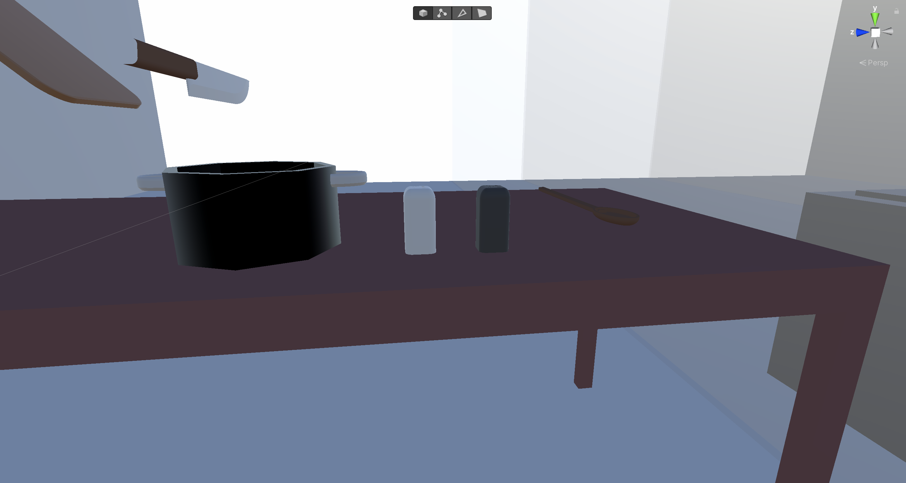

*Anyway,* the scripting for these is rather straightforward. I just had to modify the code from our interactions lab, the one with the launcher. I changed the number of objects generated, then had to add specific tags to them (you’ll see why soon). The particles themselves, Razzle and Dazzle, are just small colored spheres with rigidbodies and 3-second lifetimes (again, from the lab).

    // when activated with trigger, shakers will generate particles
    public void generateParticles()
    {
        for(int i = 0; i < 9; i++)
        {
            GameObject particle = GameObject.Instantiate(particlePrefab, generationLoc.position, generationLoc.rotation);
            particle.gameObject.tag = particlePrefab.tag;
            Rigidbody rb = particle.GetComponent<Rigidbody>();
            rb.AddForce(particle.transform.forward * Random.Range(force,1.5f*force));

        }
    }

There’s also the mixing spoon but that’s just so simple there’s no point in talking about it. Just a spoon with a trigger at the end of the spoon.

#### The Pot: The Main Interactable

By main, I don’t mean that it’s the main attraction of the simulator. If I had to choose something it’d be the cutting, cooking, or maybe the razzle dazzle, or perhaps the bomb itself. But the pot is at the center of event scripting because of how present it is throughout the entire scene.

We start with the beginning, where you need to place in cut ingredients and razzle dazzle the mixture. The idea is to make the user realize when a certain action has been completed. I was thinking of using some kind of visual (highlighting with shadow diffuses) to highlight the next item to be used, but it didn’t work out so I decided to just make the user eventually realize what they have to do next by making things appear in the pot but never increase when the number of objects placed into the pot has hit a certain limit. This is the case with the cuttable ingredients (maximum 4) and the razzle dazzle (6 each).

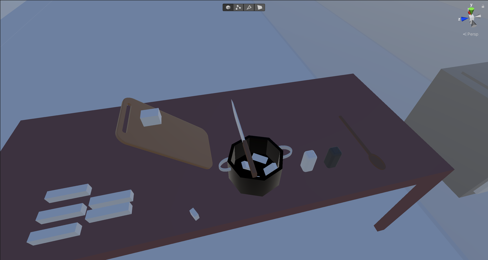

Here's the code for that bit:

    // pour cut ingredients into pot, if they are cut (not part of ingredient parent object)
    if (collision.gameObject.CompareTag("Ingredient") && collision.gameObject.transform.parent == null)
    {
        
        // deactivate ingredient
        collision.gameObject.SetActive(false);
        // if less than 4 ingredients added, increase the number of ingredients in pot
        if (ingredientsAdded < 4)
        {
            transform.GetChild(ingredientsAdded).gameObject.SetActive(true);
            Debug.Log("Ingredient added.");
            ingredientsAdded++;
        }
        //if 4 or more ingredients are added
        else if (ingredientsAdded >= 4 && !Global.Instance.ingredientsAdded)
        {
            Debug.Log("All ingredients added.");
            Global.Instance.ingredientsAdded = true;
        }

        // destroy ingredient
        //Destroy(collision.gameObject);
    }
    // razzle dazzle
    else if (collision.gameObject.CompareTag("Razzle"))
    {
        
        // deactivate particle
        collision.gameObject.SetActive(false);
        Debug.Log(Global.Instance.ingredientsAdded);
        // if less than 6 particles added AFTER ingredients added, increase the number of ingredients in pot
        if (Global.Instance.ingredientsAdded &&  razzleCount < 6)
        {
            Debug.Log("Razzle");
            transform.GetChild(4 + razzleCount).gameObject.SetActive(true);
            razzleCount+=1;
        }
        else if (razzleCount >= 6)
        {
            Debug.Log("Razzled.");
            
            // if razzle (accompanying set) has also hit 6, razzle dazzled, baby
            if (dazzleCount >= 6)
            {
                Debug.Log("Razzle dazzled.");
                Global.Instance.razzleDazzled = true;
            }

        }

        // destroy particle
        //Destroy(collision.gameObject);
    }
    else if (collision.gameObject.CompareTag("Dazzle"))
    {
        
        // deactivate particle
        collision.gameObject.SetActive(false);
        Debug.Log(dazzleCount);
        // if less than 6 particles added AFTER ingredients added, increase the number of ingredients in pot
        if (Global.Instance.ingredientsAdded && dazzleCount < 6)
        {
            Debug.Log("Dazzle");
            transform.GetChild(10 + dazzleCount).gameObject.SetActive(true);
            dazzleCount++;
            
        }
        else if (dazzleCount >= 6)
        {
            Debug.Log("Dazzled.");
            // if razzle (accompanying set) has also hit 6, razzle dazzled, baby
            if (razzleCount >= 6)
            {
                Debug.Log("Razzle dazzled.");
                Global.Instance.razzleDazzled = true;
            }

        }

        // destroy particle
        //Destroy(collision.gameObject);
    }

These were all implemented using the OnTriggerEnter function, which was used to determine the interactors and depending on the global variables states decide whether an interaction should occur. If the ingredients were all added, only then would you be able to razzle dazzle. And only if these two events happened would you be able to mix the ingredients, and so on.

    // mixing
    else if (collision.gameObject.CompareTag("Spoon"))
    {

        if (Global.Instance.razzleDazzled && !Global.Instance.isStirred)
        {
            Debug.Log("Stirred.");
            transform.GetChild(16).gameObject.SetActive(true);

            // once stirred, first wall disappears and the stove placement zone appears
            Global.Instance.isStirred = true;
            Global.Instance.transform.GetChild(0).gameObject.SetActive(false);
            stovePlacementZone.SetActive(true);

            // make pot interactable once stirred
            gameObject.GetComponent<XRGrabInteractable>().enabled = true;
        }

    }

I also used visual feedback to show the user that certain actions have been completed. Using the spoon on the pot (after both the cuttable ingredients and the razzle dazzle have been added) will show that the ingredients have been “mixed”, and placing the pot on the stove and turning it on will show that the ingredients are being “boiled” together as the surface level of the mixture will rise, giving the illusion that the ingredients are melting together.

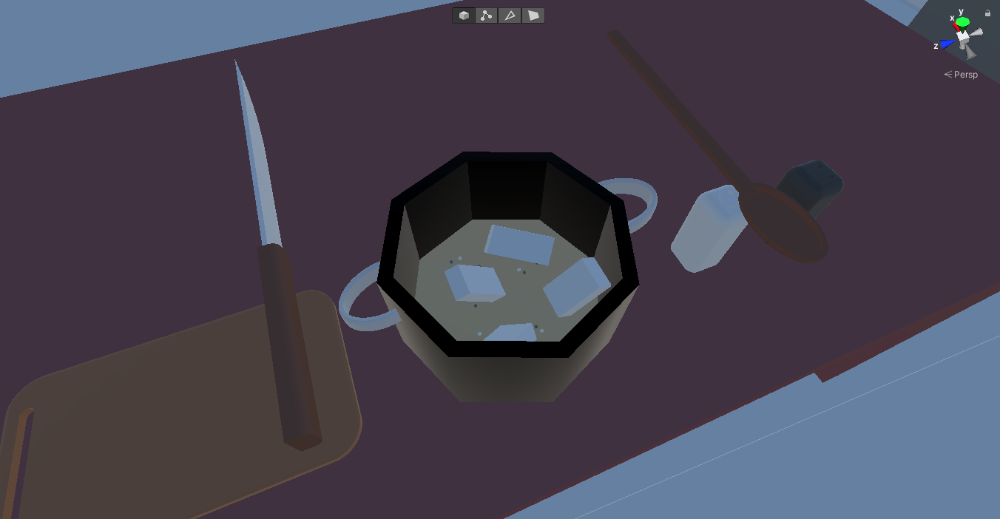

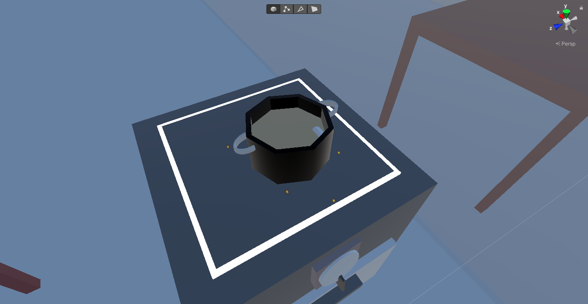

This was placed on the stove’s script after some debugging showed that when the pot is on the stove and, during the time that the user would move the dial, the trigger event would pass. But it’s still really fun to watch the ingredients ‘melt’.

And once the mixture has melted, you’re prompted to place the pot onto a table in the next station. This is where the script for the pot ends, as when you place it on the wiring table it will trigger things for the wiring of the explosive.

    // place onto mold table
    else if (collision.gameObject.CompareTag("Mold Table"))
    {
        // toggle isPlaced
        Global.Instance.isPlaced = true;
        // empty pot
        for (int i = 0; i < 19; i++)
        {
            transform.GetChild(i).gameObject.SetActive(false);
        }
        // pot is no longer interactable once placed on mold table
        gameObject.GetComponent<XRGrabInteractable>().enabled = false;
        
    }

#### The Stove 
After the razzle dazzle interactions and the mixing, the pot is then moved to be placed on the stove! The stove’s interaction sequence is as follows: 

Dial:
- Placing the Pot on the stove 
- Using the joystick to rotate the dial 180
- Ones the Trigger is hit, the dial is now cooked 
- You hear the stove turning on, followed by sounds of the gas 
The pot is now immobile and as it cooks, the mixture rises to the top 

The interaction with the dial is a bit less intuitive than the other interactions, where you need to either use the right joystick (push forward to select the dial) or a button to grab the dial, then rotate your wrist. We wanted to add some variety in the interactions, but maybe just using a direct grab interactable would have been a better idea.

#### The Wiring Table

Okay, so I’ve been using a range of words to address this. The molding table, the *moulding* table, Station 3… the point is that this is where the user will wire the bomb and complete it. The script for this bit is fairly simple, just your good ol' OnCollideEnter() checking for the collider and making the corresponding object appear on the bomb. Once it's complete, it gets rid of the final wall and lets you finish the game.

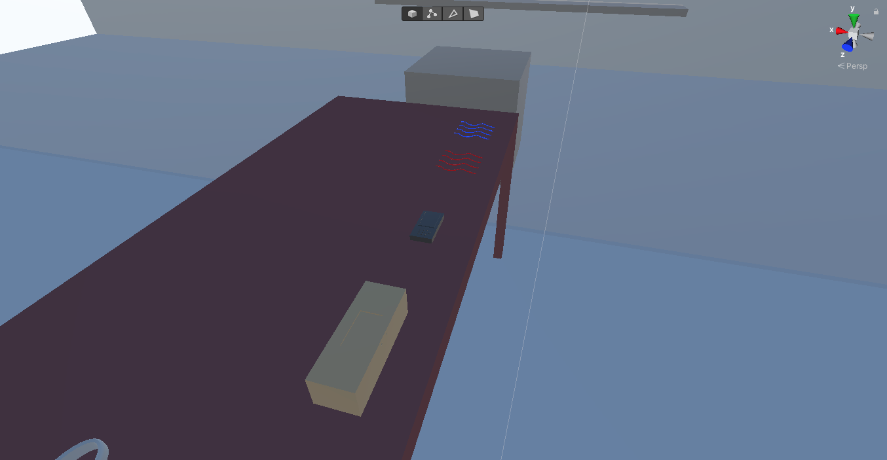

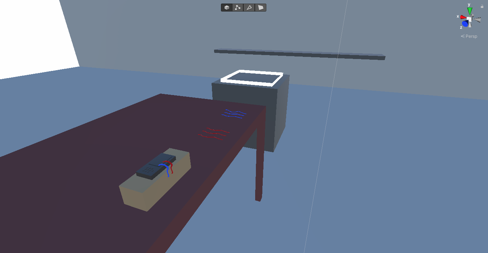

The code is also fairly straightforward:

    // yes it's kinda hardcoded but i mean it works, right?
    private void OnTriggerEnter(Collider collision)
    {
        Debug.Log("triggered");
        //Debug.Log(collision.gameObject.CompareTag("Detonator"));
        // if detonator is touched against bomb body
        if (!detonator && collision.gameObject.CompareTag("Detonator"))
        {
            collision.gameObject.SetActive(false);
            Debug.Log("detonator attached.");
            transform.GetChild(0).gameObject.SetActive(true);
            detonator = true;
            //Destroy(collision.gameObject);
            collision.gameObject.SetActive(false);
        }
        // if red wire is touched against bomb body
        else if (!redWire && collision.gameObject.CompareTag("Red Wire"))
        {
            collision.gameObject.SetActive(false);
            Debug.Log("redwired.");
            transform.GetChild(1).gameObject.SetActive(true);
            redWire = true;
            //Destroy(collision.gameObject);
            collision.gameObject.SetActive(false);
        }
        // if blue wire is touched against bomb body
        else if (!blueWire && collision.gameObject.CompareTag("Blue Wire"))
        {
            collision.gameObject.SetActive(false);
            Debug.Log("bluewired.");
            transform.GetChild(2).gameObject.SetActive(true);
            blueWire = true;
            //Destroy(collision.gameObject);
            collision.gameObject.SetActive(false);
        }

        // if bomb has been completed
        if(detonator && redWire && blueWire)
        {
            // if bomb is assembled, remove final wall
            Global.Instance.transform.GetChild(2).gameObject.SetActive(false);

            // display the "deliver here" box on the delivery table
            deliveryArea.SetActive(true);
            
        }
    }

#### The Ending

Fades to black. *Kaboom* in the background. Quits the app. Yep, I found that we can use Application.Quit() to quit the app. It took a while to work out because apparently it doesn't work when it's inside a coroutine, meaning it needs to be called explicity within the Update() function. But yeah, it's pretty cool.

#### Playtesting

We had a few people playtest our scene once we had implemented the interactions and found a few issues.

One issue was that occasionally you would be unable to grab anything–– the controllers would simply stop working as you hold objects in your hand. I *think* (very tentative) I fixed the issue, because I *think* it was triggered by me using the Destroy() function wayyy too much in the scripts for the pot and the wiring. Once I used SetActive(false) instead, the issues seemed to stop (hopefully).

We also added a kinematic option to items when they first spawned so that the user wouldn't accidentally knock things around (including the pot), which was what had been happening quite often.

Another issue was where the scene would push you off the map. We’re not sure *why* this happened, but it rarely happens (maybe once every fifteen to twenty runs). We don’t know how to fix this and frankly didn’t have the time or energy (or sanity) to try.

Overall, we got a lot of positive feedback from our playtesters. They really liked the various interactions, especially the cutting and razzle dazzle (I knew it would catch on haha). The streamline process of the stations was something that was implemented through playtesting as we realized some people felt lost when they spawned in the middle of the room.

There was also mention of a disconnect from the cooking the mixture to suddenly having a bomb to wire, though (but that was kinda the point hehe). This may have been caused by the fact that we omitted a step from the interactions, where you pour the mixture in the pot into a mold, which then can be opened to reveal the bomb. We tried to address this by making it so the inside of the pot would empty, leaving an explosive brick next to it with the same color as the mixture that was in the pot. We hoped that conveyed the transition.

#### Things Left Unsaid and Undone…

There are some features that we *wanted* to add but didn’t have the time to do so. One of them was, as mentioned earlier, the step of molding the mixture into the shape of a bomb. I wanted to make the user mold it themselves, but then due to skill constraints that turned to using a cookie cutter, then just getting rid of the step altogether as we realized that we didn't have the time to implement it.

Another thing was the UI. We wanted to implement floating text in front of each table that would tell them what they needed to do, but we didn’t have the time to put that in.

And of course there’s the super clean mesh slicing that I never got to coding. But I got something similar by thinking about how users would start cutting the ingredients based on the starting location of the knife.

Audio was something that we wanted to add–– the reports of bombings while you're cooking your mixture is meant to be a foreshadowing of what you're actually doing. And the ending report is supposed to be telling you what you're making and that you're the evil. That the evil you need to be delivered from is yourself. But anyway, that's something we couldn't get done because we were working too much on the interactions...

### But All in All… Ain't Doin' This Again (Part 2 of 3)

Things didn’t turn out too shabby. In fact, I think I’m somewhat satisfied with the product. Not fully satisfied, obviously, but I think that we did a lot given the time constraints we had. Looks like I was better prepared this time for the nightmares that were in my way. Maybe not completely prepared, but still a bit more prepared than last project.

It wasn't a complete disaster like last project, but there were still times when I felt that things were out of my control and I didn't know how to properly implement something and ended up compromising. I think there's going to be a lot of this kind of thing happening from now on. I suppose it's better than having *literally no idea what's going on*, though.

There were so many unexpected bugs and each time they triggered and I couldn't let go of the cutting board and pot I would have a moment of thinking "what am I doing?" And so I can say for a second time, I ain't doin' this again. Anyway, see you next project.

____

## our demons.

###### Collab with Rainee and Hazel. Some images may not load properly. A full documentation with images can be found [here](https://docs.google.com/document/d/1jxSutub3TDbDuDQOvQ2qeUnnLjQfdLTvXxk5bAiBYIM/edit?usp=sharing). The video walkthroughs can be found [here](https://drive.google.com/drive/folders/1XfBfHNH0NxRfxYkxnn2UpA0_c-5Jft8b?usp=sharing).

### Introducing The Final(?) Project

Okay. So, ladies and gentlemen. We. Are. Back. Another project, this one being more ambitious than the last (to the point I actually question if we were taking this too seriously), about immersive storytelling. But I mean, considering that it was the *final* project that we were doing for the semester, I can see why we took it as seriously as we did. This was a nice long run of ~~panicking, all-nighters, and crying in corners~~ learning, enduring, and persevering. And I think that we came out relatively alive and well in the end.

### The Story and Plot

May as well get into the finer details about the project and its requirements. I think that this time, we were placing a lot more emphasis on the existence of a *story*, something that somewhat existed in our past projects but not as strongly. Storytelling is something that I’ve always enjoyed and coming up with stories is something I do to entertain myself (hmmm, why am I in CS again?) from time to time. In any case, when we thought about stories to pursue, I let my mind wander (as I always do) and thought of an interesting story concerning a man named Jared (look, I didn't put much thought into it, okay).

#### The Story: Take One

I think I may have been inspired by some aspects of Supernatural, Constantine, and the Witcher, as well as just about every other exorcist/monster slayer or similar-to-such things I've watched or read. Jared (you) is a former detective/exorcist/monster slayer who deals with the supernatural. He moved out into a small town in the forests of Alaska with his wife Nora. They had a child, Emily. However, at this time it was revealed that Nora was possessed by a demon, which eventually led to Jared being forced to “sealing” her away in an abandoned mineshaft. The story of the experience would take place some eighteen years later, when Emily, now grown, learns about the truth behind her mother's disappearance and sets out to go into the mineshaft for clues. It's basically you chasing after her, knowing that she has no idea what is actually there. And it's supposed to be tragic, where Nora (whose soul is now fused with the demon) has possessed the body of Emily, leaving you no choice but to kill your daughter to prevent your wife from massacring the town. Kinda dark, and I guess that •is• a theme that runs throughout a lot of my ideas.

As you've probably already realized, the setting of the world is one where there are demons and monsters, all those supernatural things. And that was a theme that stayed constant throughout, as well as the concept of a tragedy.

#### The Story: Take Two

Anyway, as we refined the story, we decided to add a bit of (Japanese) spice. The plot was more or less the same, but the details of the story, as well as its setting, changed quite a bit. Rather than looking at Jared (his name was in the works of change) as a modern-day Supernatural-style exorcist, he became a traditional exorcist–– especially considering that the period we were considering as the setting was in the 19th century, when Japan was very adamant about sticking to tradition and culture. He became an exorcist who had dabbled a bit in Western practices (as portrayed by the gun). And his wife became a shrine maiden. All of this led to the second version of the story.

Exorcist and shrine maiden–– an interesting combo, to say the least. But it was one that worked. You and Ayane were beautifully wed and enjoyed each other’s company. You also had a daughter together, whom you named Hinako, “child of the sun”. Your days were filled with joy and happiness–– even the most tiring day could be washed away by the “welcome home” you heard as you stepped through your front door.

Then all that changed one day, all because of your carelessness. Leaving to an emergency exorcism, you left the door to your study unlocked as you rushed out the door. Never had it crossed your mind that your daughter would enter it while you were gone. When you arrived back at your house, you didn’t hear the usual “welcome back”. Instead, all you could hear was Hinako’s cries. Rushing to the study, you came across a horrifying sight: Hinako, hiding behind your desk, and Ayane, looking at you with a frenzied expression. The pendant around Hinako’s neck and the broken clay figurine on the ground told the story all too well. A demonic spirit, which had been sealed in the figurine during one of your past assignments, had broken loose, and Ayane had cast aside her divine protection in a last ditch effort to keep the spirit from harming Hinako.

As a result, Ayane was possessed. The spirit had entangled itself with her soul so badly that it was impossible to remove it without killing her, and if left alone Ayane would hunt down every living being until she was either killed or killed everyone in the town.

And so faced with an impossible choice, you sealed her away at the shrine, hoping for a miracle. But it never happened. To Hinako, you said that her mother needed to work at a shrine in a different province.

Three years have passed since that day. The pain is still fresh, though–– every time you close your eyes you can hear Ayane’s voice crying out to you, asking you to save her from her eternal prison. And you listen to her, burdened with the guilt of having torn your family apart by your own carelessness. You are listening once more when your brother, Ryuuji, comes knocking on the door. He says that Hinako has gone missing, that she was last seen heading up the nearby mountain towards the 
bamboo forest, towards the shrine that Ayane is sealed in, speaking into the air. You realize that it’s not just you that has been hearing her voice.

#### The Story: Themes

One of the main themes of the story, which led to the name 'our demons.' for the project, is the idea that "we make our own demons". It's a quote from one of the *Iron Man* movies, based off something mentioned by Oscar Wilde, that we each are our own devils, that we make the world our own hell. And that's kind of what the story is about: looking at the consequences of a person's decisions from the past and how that affects their future (in a very tragic sense).

Another theme was the concept of family bonds. One of the hardest things to do while writing the script (which wasn't fully used due to time constraints) was to make Ayane *likable*. To truly recreate the sense of longing that Hisashi feels and his hesitation when it comes to shooting her, even when the entire village is at stake. I don't think that was portrayed well enough in my initial proposal, which ended up in our project portraying Ayane as evil and very much unlikable. I think that in order to have accomplished such a feat, it would have taken an experience that was several times longer than what we have already.

### The Result

As usual, before getting too deep into the process, here's a quick look at the results of our labor. There's quite a lot to see. There are technically 5 scenes: a menu, the lobby, a cutscene, the forest, and finally the shrine, where everything comes to an end.

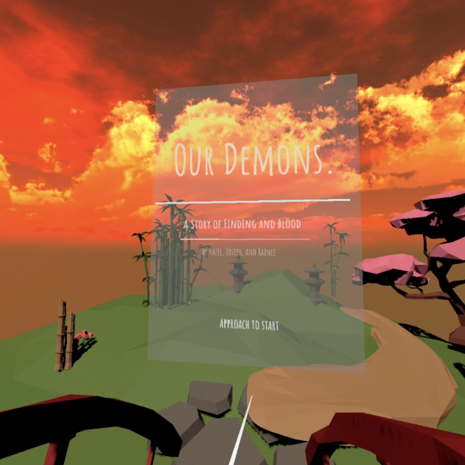
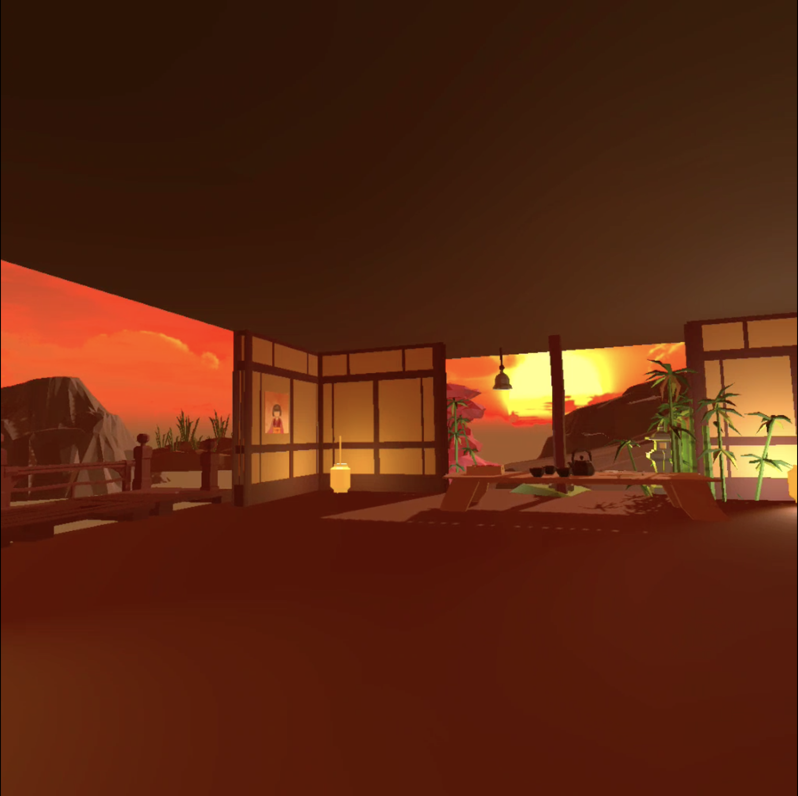
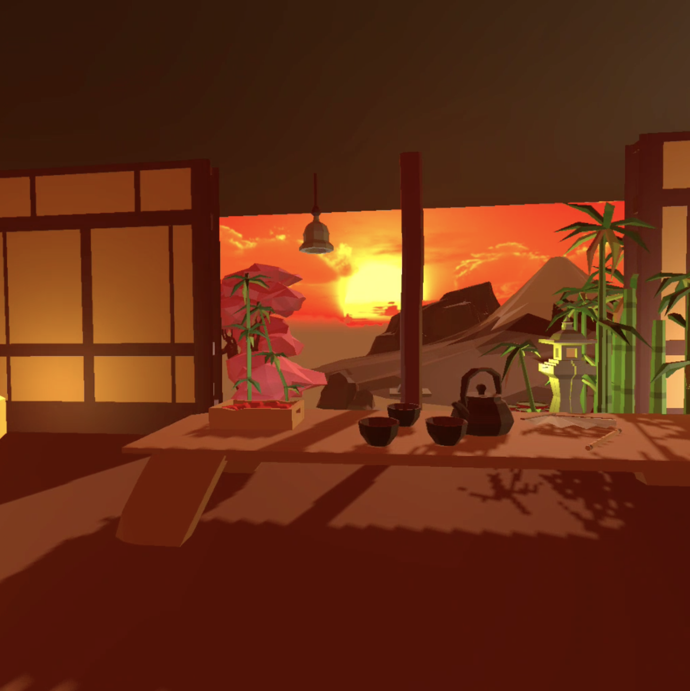
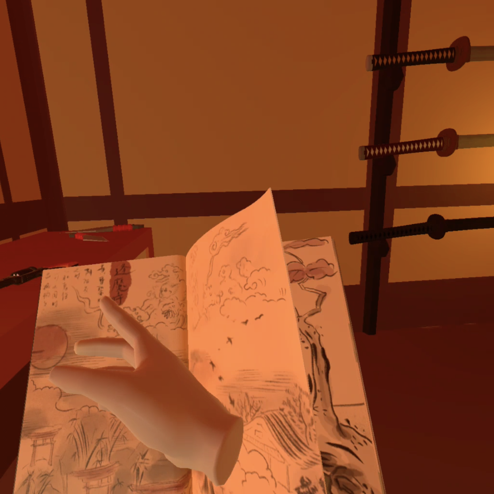

*The Menu and Lobby*

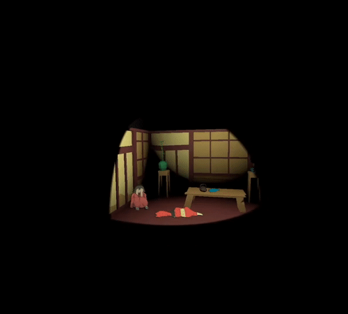

*The Theatre Cutscene*

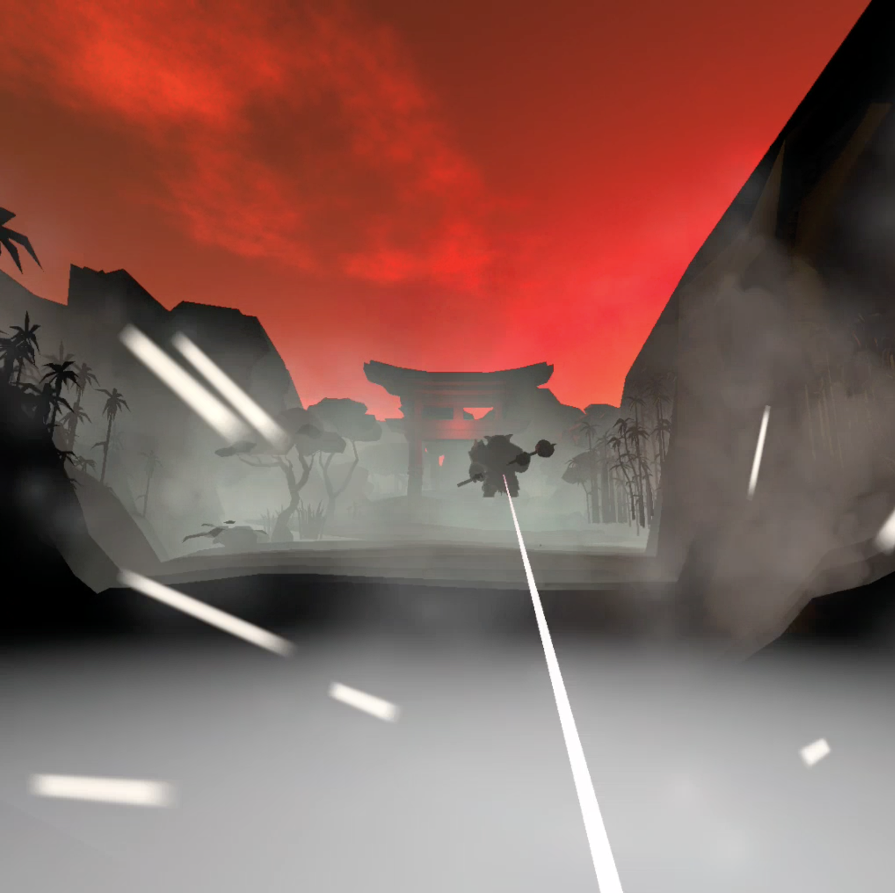

*The Bamboo Forest*

*The Shrine*

### The Process

And of course, now that we've seen the result, we should probably get into the nitty-gritty stuff. The story was divided into scenes, as mentioned earlier, and each of these scenes had their own needs, interactions, and details.

And so, in line with this, we divided the group into realms of ‘expertise’, or rather responsibilities (because let’s be honest none of us are experts in anything at this point in life). The division was as follows:

#### Visuals - Rainee

I like visuals. They can be so satisfactory, surprising, and comforting. I also know how important visuals are. They set up the vibe, strike emotions, and tell a story themselves. So I took on the role of visual designer,and designed and coordinated all the visual elements in our project. My main roles include：
Build 4 VR scenes with informational and aesthetically pleasing content
Make 3D models and XR prefabs for specific interactions
Draw illustrations to strengthen the visual communication
Design UI interface for the onboarding scene
Write C# scripts for simple XR interactions

Next, I will walk you through my visual design journey. Please come with me :)

###### The images are not all uploaded. A full documentation with images can be found [here](https://docs.google.com/document/d/1jxSutub3TDbDuDQOvQ2qeUnnLjQfdLTvXxk5bAiBYIM/edit?usp=sharing). 

##### Environment Design 

We intended to use environmental storytelling as a key element of an immersive experience. Ideally, everything you can look at has a meaning, and every object, layout, color tells part of the story. I designed the space based on the following principles which I hope are at least partially achieved in our final delivery: 

1. Strong visual communication. Everything we put in must convey a message. 
2. Interior design elements. This can be best explained by the lobby scene, the house. The style must fit the historical context and character’s background. The items should be selected and placed properly. 
3. Space arrangement should always make sense in terms of users’ navigation routes. In the bamboo scene, we crafted a road in the middle of a bamboo forest, guiding users to climb up. 
4. Consistent and stylish aesthetics: We use low poly as the basic style. It is lovely and gives more room for device performance.

##### Assets

While we are using 3rd party low poly assets in most of the places, we adjusted them quite a lot to fit the special use and also made our own assets. This saves us a lot of times from building everything from scratch, and has a consistent visual style. So we can focus more on the interactions that tell stories or push forward the plots. 

##### The book
In the lobby scene, I made a book which you can actually flip through, read, and listen to. This book is *your* work journal, documenting the yokai you have hunted before. I selected the portrayed youkai based on real Japanese folklore. They live in mountains, and have something to do with their family. This is intended to hint the time when the story happens, the job of the character, a response to the environment, and a trailer of what will happen next: you will encounter some of those yokai, either their voice or human embodiment, in the following scenes. 

##### The paintings, portraits, and photos
As demonstrated in scene 2: Memory, I also drew the paintings for the characters’ portraits. I did so not to show off my painting skills but to, again, make the story more clear. Since we are using dialogues and voiceover to tell the story, the characters didn’t show up until the story was already too heavy to catch up without visual messages. For a more user-friendly way of storytelling, it is essential to visually clear things out: who are Hisashi, Hinako, Ayane, and Ryuuji? How do we even spell their names? What do they potentially look like? Those are all revealed as a spotlight lights up the photos on the wall, as the voiceover introduces every one of them. 

This was the cheapest way to tell as much of the story as we could in a less boring way. And admittedly, it was a nice mix if we put 2D drawing and 3D environment together, This somehow also echoes to the time when the story happens, when there was no chamera

I simply used Probuilder to build many boxes as frames and canva, then applied the paintings as the base map of a material, and then applied the material. I then animated those paintings to engage users, so that they don’t feel bored after hearing and watching for a long time. 

##### Lighting as part of storytelling
I used color contrasts to create different tensions and vibes to push forward the plot. In the house scene, the lighting is warm orange, with a nice sunset view. We are trying to create a zena and peaceful atmosphere to give users enough energy to collect information. While in the memory scene, the spotlight echoes to the oral narrative, lighting up the corresponding illustrations showing the same plot. In the bamboo scene, the sky bleeds, and it is foggy. This is the most intense and even horrible scene. In the last scene, it is bright again, giving you false hope of “finding Hinako '' which turns out to be only her soul – she was eaten by her mom. 
The use of spot light in the memory scene was to create a dramatic atmosphere

##### 3D Animation: the 2.5D theater experiment
Finding the cheapest way to convey the most condense and essential parts of the story. Inspired by an award winning VR story, the book of distance, I was astonished by how visually intriguing it is to when 2.5D meets 3D.

#### Audio - Hazel

##### Dialogue

We developed the very first version of dialogue from our script [Project 3 Story Draft - Google Docs](https://docs.google.com/document/d/1gNRwIKRu3ZfWL_XIQKe4sougpuL44JMnqfeOfXkh66g/edit), imagining the most natural way of a common conversation while showing the player as much important background and plots as possible. Most of the dialogue happens between Hisashi, our protagonist, and Ryuuji, his brother/mentor, ending with a culminating conversation with Ayane where the conflict between them guides the player to make a final decision. During recording, the tongue-twisting lines get removed.

##### Background Music
From a few hours of searching and listening to, *keyword: Japanese, Horror, Triller, Ominous, Music, Instrumental,* finally found a perfect match from Hans Zimmer’s scores of The Last Samurai and edited it to the length and emotions that we want in our scene (shown in the Memory Scene Screenshots). Other background music is picked according to the emotional journey of the player too.

##### Sound effects

I made a seperate audio script which outlines all the sound effects that needs to be added [YESNEW AUDIO of AR Project 3 Script Draft v1.0](https://docs.google.com/document/d/1Qm1hueVgGKUc6HndG_tESjcEZ_xWfP8Vp5boF0KEysM/edit?usp=sharing). Then I looked for sound effects on Youtube and Freesound. This is a listening and picking job which doesn’t need to be debugged (which is blessed). Some sounds need to be triggered or stopped, for example the Oni sound which should start when they approach and stop when they are dead. Thanks to Professor Michael Allison!!! He made this come true. And then I added different audio sources to different objects and twisted their 3D sound settings and reverbs. 

##### Animations

To achieve the manageable cinematic storytelling as I imagined, I used timeline animations to make the characters alive. This is a process of frame by frame adjustment of position, size, and rotation of objects. In the first version, all the characters only stand on the shrine stage to make their gestures since I couldn’t find out how to incorporate the animator that we learnt in autonomous agents to the timeline system. They turned out to be incompatible with each other so I continued on the timeline tool since I’ve done a large part of it. Later Professor suggested to me maybe it would work to record the animation of a parent object and yes it worked! The characters are moving around now. Walking and yelling, evil laughing and being cocky, calling magic spells and being dead, hooray!

#### Scene Transitions - Joseph

Obviously, in a multi-scene experience, you need to have scene transitions. This one is somewhat straightforward, as I used the code from the lab. However, after getting feedback from playtesting, I also added a section within the transitioning process that would hide the unloading from the player. See, because our scenes were so big, it would take a while to load and players would be staring at empty air for a few seconds. So I created a black box that would envelope the player during those transitions, to make it seem more... robust. This was also paired with the CheckScene() function from the player (explained later). Here's a quick look; the box is the 'load screen':

    IEnumerator Load(string scene)
    {
        isLoading = true;
        yield return StartCoroutine(Fade(1.0f));
        PlayerManager.Instance.ShowLoadScreen();
        yield return StartCoroutine(UnloadCurrent());

        yield return StartCoroutine(LoadNewScene(scene));
        PlayerManager.Instance.CheckScene();
        PlayerManager.Instance.RemoveLoadScreen();
        yield return StartCoroutine(Fade(0.0f));
        isLoading = false;
    }

#### Interactions - Joseph
(This part is written by the Lead Unity Engineer and Interaction Designer Joseph Hong)

Suffered. You got that right. There are actually quite a few interactions in the experience and they took varying amounts of time to implement. Oftentimes they were rather easy to initialize, but then started getting more and more complicated as we started adding finer details on how things should look and work.

##### The Player Manager: Tracking Objects

Of course, to interact, you need the player. First off, smooth locomotion was a unanimous decision on the navigation system. We wanted to create a seamless experience and thus increase the immersiveness of our narrative (and it worked quite well for the most part, except when you suddenly fell off the map out of the blue during our playtests). But more so than that was *how* I was planning on implementing the interactions and events that would happen to the player.

I think this was the first times that I actually decked out the entire XR Rig to suit those needs. I added all sorts of colliders and triggers, controllers (eye, ray, direct), and the good ol' singleton for the Player Manager object. This was the solution I had arrived at when considering the fact that there would be scene transitions. You see, the thing about having multiple scenes at once is that it's rather had to create interactions that have lasting impact between the two. There are methods like transferring objects across scenes, but I also wanted to keep track of all of those events happening, then create changes directly in the player. And that led to a Player Manager singleton with like 15+ different public objects to keep track of and enhance the player's interactions:

    // XR Rig
    public GameObject xrRig;
    public GameObject leftHand;
    public GameObject rightHand;
    public GameObject leftCont;
    public GameObject rightCont;
    public GameObject leftWrist;
    public GameObject rightWrist;

    public GameObject revolverAimRight;
    public GameObject revolverAimLeft;

    // Load Box Group
    public GameObject loadScreen;
    public GameObject endingTitle;

    // Player Objects
    public AudioSource audioSource;
    public GameObject lantern;
    public Light lanternLight;
    public GameObject revolver;
    public GameObject mainHolster;
    public GameObject holster;
    public GameObject holsterSpawn;

    // ending
    public AudioClip laughingEnd;
    public AudioClip onShotClip;   // saying sorry after shooting
    bool hasEnded;

    public bool hasRevolver = false;
    public bool hasLantern = false;

    public bool checkScene = false;

    Scene xrScene;

In any case, because of this it was a lot easier triggering interactions and changes in the player without having to go into the trouble of searching for specific game objects inside of certain scenes.

##### The Player Manager: WaitToSpeak(), CheckScene()

There were also some special objects inside the player that I created in order to help things such as dialogue, though they weren't really used from the sound-side. I placed an audio source inside of the player so that the player would have their own *designated* audio source, meaning no chance of overlaps. In order to further prevent this, I created a coroutine function that would prevent the sudden change in dialogue when something is triggered, instead saying it after the line has been finished: this is the WaitToSpeak() function.

    public void WaitToSpeak(AudioClip clip)
    {
        coroutine = StartCoroutine(WaitForDialogue(clip));
    }

    // wait till audio is finished if it's still playing
    IEnumerator WaitForDialogue(AudioClip clip)
    {
        while (audioSource.isPlaying)
        {
            yield return new WaitForSeconds(clip.length / 2);
        }
        
    }
    
It's actually rather simple, and is used in tandem with changing the audioSource clip and playing it, like this:

    // wait if player is already speaking
    PlayerManager.Instance.WaitToSpeak(PlayerManager.Instance.audioSource.clip);
    PlayerManager.Instance.audioSource.clip = desiredClip;
    PlayerManager.Instance.audioSource.Play();

Another little tidbit I added was the CheckScene() function, which will basically ensure that you have the necessary items on your person when entering a scene *if you don't have them on you*. For example, if you were to have accidentally dropped your gun somewhere in a scene, then were transported into a new scene where you need it again, it'll appear in your holster. This was done using a lot of if statements and comparing the scenes in order to decide what needed to be done. This often dealt with the speed of the player and what items they had on them at the start of the scene, as well as what items should/shouldn't be loaded.

    // check scene to see what needs to be loaded and what doesn't
    public void CheckScene()
    {
        PlayerManager.Instance.xrRig.GetComponent<ContinuousMoveProviderBase>().moveSpeed = 2;
        // activate ray if in first scene
        if (XRSceneTransitionManager.Instance.currentScene.name == "Menu")
        {
            lantern.SetActive(false);
            revolver.SetActive(false);
        }
        else
        {
            // deactivate rays
            revolverAimRight.SetActive(false);
            revolverAimLeft.SetActive(false);
            if (XRSceneTransitionManager.Instance.currentScene.name == "House"){lantern.SetActive(true);}
            else{lantern.SetActive(false);}
            revolver.SetActive(true);
        }
        if (XRSceneTransitionManager.Instance.currentScene.name == "Bamboo" || XRSceneTransitionManager.Instance.currentScene.name == "Shrine")
        {
            // if revolver is not holstered (was dropped somewhere in prev scene), holster it
            if (!RevolverController.Instance.isHolstered)
            {
                revolver.transform.position = holster.transform.position;
                RevolverController.Instance.HolsterWeapon();
            }
            if (hasLantern)
            {
                lanternLight.gameObject.SetActive(true);
                lantern.gameObject.SetActive(false);
            }
            PlayerManager.Instance.xrRig.GetComponent<ContinuousMoveProviderBase>().moveSpeed = 1;
        }
    }

##### The Revolver

This one is a pretty cut-and-dry case. There was quite a lot of scripting (which is a given for such an object). I'm not sure if this means that I've become numb to all of the work that goes into scripting an interactable. Once again, as with the Player Manager, I decided to make the revolver into a singleton object because of how crucial it is in the story and I didn't want to accidentally spawn two, given the special feature of *limited bullets* that it had. The first pickup of the object triggers an easter egg from Supernatural, about the Colt that can "kill anything", but that's just something I added for fun.

Anyway, when it comes to the actual firing of the revolver, there are certain scenes where you can and other scenes where you can't. For example, you can't shoot inside of the house or a cutscene. In these situations, I made it so that audio would play, letting the player know that they shouldn't be doing what they're trying to do.

In the case that they *did* have the ability to shoot, I used a similar feature to the previous project where I would set the children of the revolver visual to inactive in order to give emphasis that a bullet has been shot and that you are running out of bullets. There are only six shots available, and after that trying to shoot will only trigger empty chamber noises. There were some more things I wanted to add, such as the barrel of the gun rolling on shot along with the hammer moving, but there just wasn't enough time for that. Here's the excerpt of the revolver's firing sequence:

    public void Launch()
    {
        // only able to fire in certain scenes
        if (XRSceneTransitionManager.Instance.currentScene.name == "Bamboo" || XRSceneTransitionManager.Instance.currentScene.name == "Shrine")
        {
            canFire = true;
        }
        if (canFire)
        {
            isFiring = true;

            if (bulletCount > 0)
            {
                // shoot bullet
                GameObject projectile = GameObject.Instantiate(projectilePrefab, launchSpawn.position, launchSpawn.rotation);
                Rigidbody rb = projectile.GetComponent<Rigidbody>();
                rb.AddForce(projectile.transform.forward * launchForce);
                // particles
                if (bulletCount == 6)
                {
                    // particles
                    for (int i = 0; i < particleGroup.transform.childCount; i++)
                    {
                        particleGroup.transform.GetChild(i).gameObject.SetActive(true);
                        ParticleSystem effect = particleGroup.transform.GetChild(i).gameObject.GetComponent<ParticleSystem>();
                        effect.Play();
                    }
                }
                for (int i = 0; i < particleGroup.transform.childCount; i++)
                {
                    particleGroup.transform.GetChild(i).gameObject.SetActive(true);
                    ParticleSystem effect = particleGroup.transform.GetChild(i).gameObject.GetComponent<ParticleSystem>();
                    effect.Play();
                }
                // sound of firing
                audioSource.clip = gunshot;
                if (audioSource.isPlaying)
                {
                    audioSource.Stop();
                }
                audioSource.Play();
                // get rid of bullet (front)
                GameObject child = visual.transform.GetChild(6 - bulletCount).gameObject;
                child.SetActive(false);
                bulletCount--;
                RecoilObject.recoil += 0.1f;
            }
            else
            {
                // sound of empty gun
                audioSource.clip = empty;
                if (audioSource.isPlaying)
                {
                    audioSource.Stop();
                }
                audioSource.Play();
            }
            isFiring = false;
        }
        // if in a place where you can't shoot, don't allow user to shoot
        else
        {
            PlayerManager.Instance.WaitToSpeak(PlayerManager.Instance.audioSource.clip);
            PlayerManager.Instance.audioSource.clip = dontShoot;
            PlayerManager.Instance.audioSource.Play();
        }
    }

##### The Holster: From Playtest Feedback

When you have a gun, you need a holster. This was something that was felt during the playtesting, since when you hold an object you no longer can use the joystick of said controller. Because of this, people would constantly be dropping the gun or switching back and forth between hands in order to navigate through the game. And so I decided that I would make a holster.

At first, I tried to use a socket interactor. I have no idea why, but it didn't seem to work no matter what I tried. And so I decided to go the brute-force way, which was basically just scripting my own holsters from scratch. Using a main holster object, I created two side holsters with their attaches, then made this follow the rotation of the main camera (so that they wouldn't just hang suspended mid-air in the wrong way). This was done by slowly transitioning the rotation to match that of the camera object. Here's part of the code:

    // update the position of the holster to follow the main camera
    transform.position = new Vector3(mainEyeAnchor.transform.position.x, mainEyeAnchor.transform.position.y/1.05f, mainEyeAnchor.transform.position.z);
    transform.forward = transform.forward * 1.1f;
    [adjust the rotationSpeed]
    // final step size is the speed * time frame time
    var step = finalRotationSpeed * Time.deltaTime;
    // rotate towards desired rotation angle
    transform.rotation = Quaternion.RotateTowards(transform.rotation, Quaternion.Euler(0, mainEyeAnchor.transform.eulerAngles.y, 0), step);
    
And of course, once that was set, the next step was actually getting the gun to holster. This was done revolver-side, with the HolsterWeapon() function. I had to look at a tutorial for this one, since I wasn't really sure how to make it work properly. If there's something different that I did, well it's that I didn't actually re-code the grabbing script; I just added the function to the revolver's controller. Basically, it'll check to make sure that there's a holster that's nearby and that it's not holstered already, then will transform the gun into the holster. Here's the function:

    // holster weapon (if applicable)
    public void HolsterWeapon()
    {
        var holsters = GameObject.FindGameObjectsWithTag("Holster");
        foreach (var holster in holsters)
        {
            var distanceToHolster = Vector3.Distance(transform.position, holster.transform.position);
            var childrenOfHolster = holster.GetComponentInChildren<ICanHolster>();
            // if distance is close enough
            if (childrenOfHolster == null && distanceToHolster < 0.2f)
            {
                // set position and rotation of revolver to holster attach
                transform.rotation = holster.transform.GetChild(0).transform.rotation;
                transform.position = holster.transform.GetChild(0).transform.position;
                // turn on kinematic and set holster as parent object
                GetComponent<Rigidbody>().isKinematic = true;
                gameObject.GetComponent<FloorTimeout>().spawnLoc = holster.transform.GetChild(0).transform;
                transform.SetParent(holster.transform);
                isHolstered = true;
            }
            
        }
        
    }

##### The Onis

One of the main interactions in the experience, of course. If you have a revolver, you want to shoot it, right? And that's what happens in the third scene, where a trigger spawns an *oni*–– a troll ––which will run at you, and which you have to shoot to kill. This was part of the script that I created for the onis. They were made as Nav Agents that would take the player's position as a destination point and head there accordingly. They also had animation controllers to keep track of their states. But wait, it doesn't end there. Once you kill it, it'll spawn *another* oni! And after that one, another. And that's the second part of the code, which spawns a new oni on death.

    void Update()
    {
        if (!isDead)
        {
            bool isMoving = agent.velocity.magnitude > 0.01f && agent.remainingDistance > agent.radius;
            Vector3 velocity = agent.velocity;
            animator.SetBool(isWalkingHash, isMoving);
            velocity = transform.InverseTransformVector(velocity);
            animator.SetFloat(velocityXHash, velocity.x);
            animator.SetFloat(velocityZHash, velocity.z);
            Vector3 PlayerLoc = PlayerManager.Instance.xrRig.transform.position;
            agent.SetDestination(PlayerLoc);
        }
        else
        {
            agent.SetDestination(transform.position);
            gameObject.GetComponent<CapsuleCollider>().enabled = false;
            if(nextOni != null)
            {
                coroutine = StartCoroutine(SpawnOni());
            }
        }
    }

    private void OnTriggerEnter(Collider other)
    {
        if (other.gameObject.CompareTag("Player"))
        {
            animator.SetBool(isWalkingHash, false);
            animator.SetBool(isAttackingHash, true);
            isAttacking = true;
        }
        else if (other.gameObject.CompareTag("Bullet"))
        {
            animator.SetBool("isDead", true);
            sound.Stop();
            isDead = true;
        }
    }

Something that was removed, but I really wish we kept, was the feature of resetting the scene when they attacked you–– essentially telling you that you needed to save your bullets to kill them all. It was removed because there wasn't enough of a transition to let the user know what happened, as well as the fact that the scene leading up to the shooting bit is rather long.

##### The Lantern: Another ~~Nightmare~~Obstacle

I don't really know why it was so hard trying to decide what to do with the lantern. The thing is, the lantern goes on the left hand, but that's also the hand used to navigate. And that means you can't move when you're holding the lantern, which is kinda counterintuitive. That was another big issue that came up during playtesting. So I decided that I'd create some kind of socket holder for the lantern.

And I failed. Miserably, too. The socket wouldn't work. I thought about adding a hinge joint and adding swinging physics, but it just ended up making everything go crazy (crazier than it already was). So I dropped it. Six hours of debating later, I just settled on simply deactivating the object and making a light source on the player's main camera light up, to give the effect of a 'lantern' being held to illuminate your sight.

    // essentially picking up lantern, now illuminates your view
    public void LanternPickup()
    {
        PlayerManager.Instance.hasLantern = true;
        PlayerManager.Instance.lanternLight.gameObject.SetActive(true);
        gameObject.SetActive(false);

    }

##### The Ending

And of course, we needed to end the experience, and for this we created two possible scenarios. This was done by creating a script that would decide Ayane's fate. It's actually a very simple script, one that calls some of the functions that are inside the Player Manager (see, told you it was useful). If a bullet hit her, that meant that the player shot her, and she would die and the game would end with the gunshot. On the other hand, if she came in contact with the player, that would mean that a) the player did not shoot her or b) the player wasted their bullets on something else, resulting in the player's death and the second ending.

    private void OnTriggerEnter(Collider other)
    {
        // if the ending is about to be triggered, go for it bruh
        if (isKillable)
        {
            if (other.gameObject.CompareTag("Player"))
            {
                PlayerManager.Instance.EndingOne();
            }
            else if (other.gameObject.CompareTag("Bullet"))
            {
                PlayerManager.Instance.EndingTwo();
            }
        }
    }

And to make the player *finish* the dialogue before shooting, I added that 'isKillable' boolean, which decides if she is, in fact, able to be killed at that moment. This is set using a signal from the animation timeline, which in turn calls the function Killable():

    public void Killable()
    {
        isKillable = true;
        xr.SendHapticImpulse(0.7f, 1f);
    }

##### Other Interactions

Of course, this is just the main stuff that I focused on throughout the project. There are other interactables, such as the paintings which trigger dialogue about the family when looking at them or the door triggering and animations, as well as other features such as the many, many border boxes I created around all the maps so that players wouldn't wander off. It's not so much that they aren't important, per se, but rather just that there are so many things that I didn't realize I actually ended up doing throughout the project. I also ended up working on a lot of the animation controllers and the Nav Agents throughout the project, which wasn't too bad, but it was a bit tough juggling that alongside recording audio, setting up dialogue for certain object interactions, scripting (both dialogue and c#), scene-editing, and the likes. But yeah, I'm pretty sure the others will go more in-depth into those.

### Playtest & Feedback

I’ve already mentioned this earlier, but a lot of changes that we made came as a result of the playtesting that some of our friends did for us. Aside from what we've already mentioned here, some things that were pointed out were:

- The visuals are very cohesive and detailed, which adds legitimacy and immersion to the whole story
- The user is barely left alone to themselves, as the audio consistently guides and narrates the progress in the game
- THE BOOK !!! The book asset pushed the boundaries of what i thought was possible in Unity, and the execution of it was seamless
- From an observer standpoint, I think the absence of a navigation ray made the casting experience less cluttered, and I think that's also relevant to the user, as the UI is not there to create distractions nor interruptions in relation to the 4th wall.
- Wished the onboarding was somewhat more user friendly; while the story is well shaped and encapsulated, the use of japanese (?) words was not always the best for an international audience. It could've been nice to have a “vocabulary” sheet, or at some point, a reference screen, to CLEARLY establish the meaning of each word/concept/character. It was somewhat easy to forget “oh what does this mean gain” and that creates unnecessary friction in the user experience.

### Left Unsaid and Undone, Again

Once again, as with pretty much every project, there are words that were left unsaid, things that were left undone. There were a lot of different ideas that we juggled around with throughout the project, but ideas that never ultimately made the cut. Some of these we've already mentioned, like the joint-hinge lanterns or the scene reset for the onis, but there's still a lot left unsaid and undone.

UI was something that we really wanted to do but couldn't get done in time. Especially subtitles. Those were what we had in mind from the start but didn't actually do in the end, as it got cut during the MVP-making process. Subtitles would have helped a lot, especially in scenes where either the music or sound effects got too loud, or maybe when you want to explicitly tell the user something. The UI would also have helped a lot in telling the user what to do next or hinting where they should go afterwards, or maybe things that they can interact with.

Another thing we didn't implement was the addition of more interactions inside of the bamboo forest. It's a freaking creepy forest–– there were so many different ideas for all sorts of *youkai* that could be creeping around, and you would have to navigate through that forest through those creatures. It would have been very interesting (and the book was supposed to foreshadow their appearance, but we had to drop it—– once again, during the MVP cut) and fun to implement. Alas, time was not on our side.

A fully-scripted dialogue system was also something that was on the table for some time–– a system that was scripted so that it could include more than just animations, but also subtitles and UI objects as well. This was dropped because the learning curve for learning how to script and use that for a dialogue system was too steep for the time that was allotted to the project.

### The MVP: *Snip, Snip*

And I think that's a common theme in a lot of the features that were put aside to create a working product: they were dropped before or around the time of the MVP. That deadline made us realize how much time we had left based on how far we'd come, and how much we could realistically do given that time. It really cut down the project to the bare bones structure, but that was what we needed considering that we had too many ideas and not enough time to implement all of them. All in all, the MVP and the playtesting were two factors that greatly helped us decide what to cut, what to keep, and what to add to our experience in order to drive the narrative further and make it all the more immersive.

#### I Ain't Doin' This Again (Part 3 of 3)

And so it ends. Hey, we made it to the end of the semester! And *you* made it to the end of this documentation. Truth be told, I’m leaving rather unsatisfied with the project. There are so many areas for improvement, so many more things that could have been implemented if there was just more time to do so. But there’s only so much you can do with the time that you’re given, as well as the skills you have at that time. Could I have done more? Perhaps. Are there things I would have done differently if I went back? Definitely. But at this point in time, none of those things matter in the sense that what’s done is done. We worked on the project and invested a lot of time and effort (or so I’d like to believe) into it, and the result we have isn’t terrible; if anything, it’s rather decent. There’s room for improvement, obviously, but the topic and story that we were trying to tackle and portray was rather ambitious, as were a lot of the interactions that were ~~attempted but failed miserably~~ dropped and along with it parts of the story.

But despite all of that we managed to come together and produce a final output that runs, has a story, and is, well *immersive*. In that sense, I say that this project can be considered a success. There are a lot of lessons learned, of course, about how to do things and how not to. But with the class coming to a close, those lessons may not seem usable now. However, I know that they *will* be in the future. That’s where we’re going, I guess. *Forward*, into whatever life leads us.

I know I said that I ain’t doing this again, and I still stand by my words, no matter how many times I *have*, in fact, done it again. And I will probably continue to do so, knowing me, complaining with every step but secretly enjoying the entire way there. Forward, right? To whatever project may be ahead. But this time, I’ll be ready.

#### Rainee

Hello! Yes, we made it to the end! Yay!🎉 As (over) optimistic as I always be, I am actually quite satisfied with the final delivery, especially given the time and skills we had at the moment. For me, it’s not about how perfect the project is in the end, which is clearly not the case; it is about, rather, how far we’ve been in our journey of creating a whole world from scratch, imaging, crafting, and engaging other people. And we all deserve to just take a moment to celebrate everything we have learned, created, failed, crashed, and even just dreamed of, along the journey of world making! Isn’t it COOL?! I mean, it is creating a whole virtual WORLD we are talking about. Can you even imagine we learned how to push a project to GitHub just 3 months ago(not Joseph tho😂)? Yo, I am so proud of ourselves! And I am so grateful to our amazing professor Micheal. He’s amazing. With his help and encouragement, and his style of teaching, I don’t feel small. I feel myself supported, progressing and learning all the time! Whoever is reading this should take a course with him. Anyways. Wow. Aren’t we the cool tech people that every 8 year old wanna be? Since we have already talked about the project itself in detail, I can finally be emotional now lol. 

#### Hazel
Hello again!! Guys!!! After ‘panicking, all nighters, crying in the corner,’ I mean, we made it! I can never imagine at the end of 2021 fall semester, the ones who never touched Unity before could make such an immersive storytelling.
